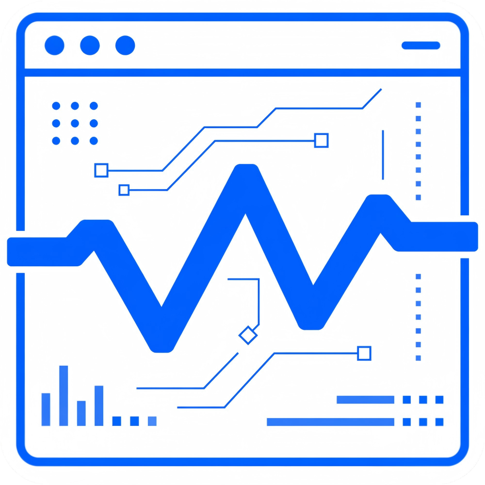
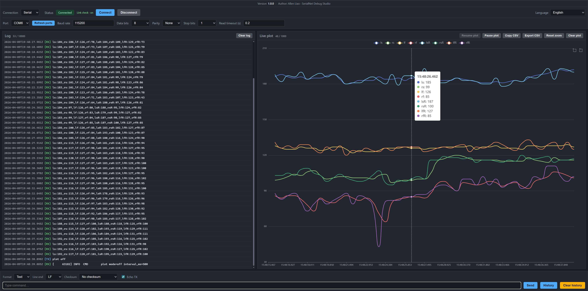
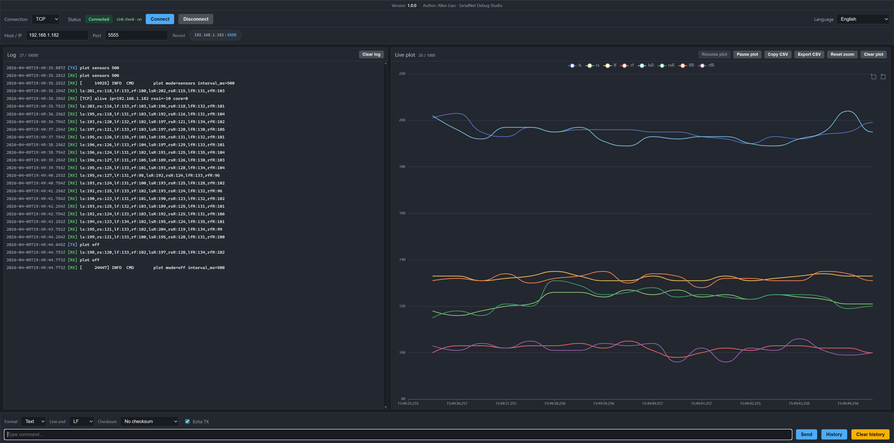
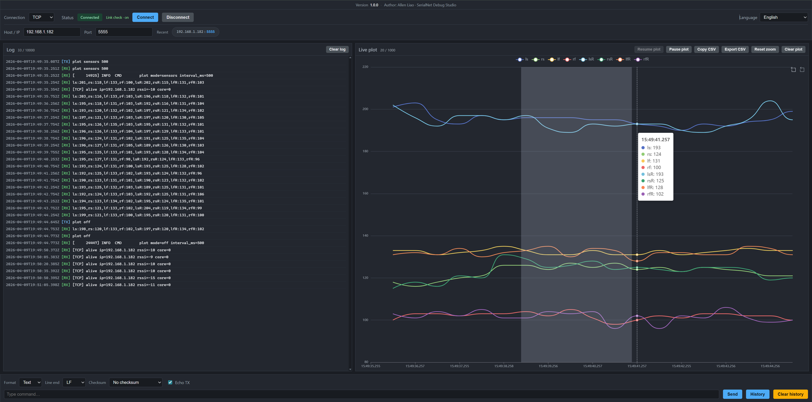
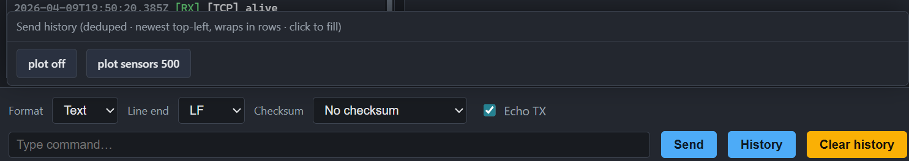

# SerialNet Debug Studio

<p align="center">
  
</p>

**[简体中文 README →](README.md)**

A locally hosted web-based debugger: the browser provides the UI and live charts; a **FastAPI** backend handles **serial / TCP / UDP** I/O. **WebSockets** push logs and parsed numeric data—no database or login required.

**SerialNet Debug Studio** is a local **serial monitor**, **TCP/UDP debugging tool**, and **serial plotter** style dashboard for **embedded development**. It provides protocol-friendly sending, live logs, named multi-channel charts, HEX input, checksum options, and a browser-based UI that can serve as an enhanced alternative to **Arduino Serial Monitor** and **Arduino Serial Plotter** for many workflows.

## Use cases / Search intent

- **Serial monitor** for COM / UART device logging and command sending
- **TCP debugging tool** for local TCP client bring-up and device testing
- **UDP debugging tool** for packet send/receive and local listening
- **Serial plotter** style visualization for sensor, ADC, telemetry, and lab data
- **Embedded debugging tool** for Arduino, ESP32, STM32, MCUs, and gateways
- **Local web-based debugger** with Python backend, browser UI, no cloud account, no database

## If you are looking for

- a local tool that supports **Serial / TCP / UDP**
- a **serial monitor** with **HEX send**, **line ending control**, and **checksums**
- a browser-based alternative to **Arduino Serial Monitor**
- a lightweight multi-channel **serial plotter** for named fields
- an **embedded debugging dashboard** with both logs and live charts

this project may fit your workflow.

## Why this project

When debugging embedded work, the **Arduino IDE** Serial Monitor is still oriented largely around **USB / Bluetooth**-style links; it is awkward for **Wi‑Fi** stacks (**TCP/UDP**). The console is crowded and hard to read, and outbound traffic is not easy to **tailor** (checksums, line endings, hex payloads, and so on). The **Serial Plotter** is handy but limited in protocol and workflow. **Serial Studio Pro** is capable but heavy for everyday use, and even straightforward network use can be paywalled.

**SerialNet Debug Studio** sits in between: one **local web UI** with **serial + TCP + UDP**, clearer logs, **ECharts** multi-series plots, and a send path you can shape for real protocols—no cloud account, no database—aimed at lighter-weight embedded bring-up and field debugging.

## Compared with common tools

- Compared with **Arduino Serial Monitor**: it supports **TCP / UDP** in addition to serial.
- Compared with **Arduino Serial Plotter**: it adds **named channels**, multi-series charts, and protocol-oriented sending controls.
- Compared with heavier desktop suites: it stays **local-first, lightweight, and browser-based**.
- Compared with tiny packet tools: it adds **charting, send history, checksums, and multilingual UI**.

## Architecture and screenshots

### Architecture diagram

The diagram below summarizes the full flow: **Serial / TCP / UDP** devices on the left, the **FastAPI** backend with connection management, parsing, and **WebSocket** updates in the middle, and the browser-side panels for connection, logs, charts, and sending on the right.


### UI screenshots

| Serial connection and live chart | TCP debugging view |
|---|---|
| In serial mode, the left side shows live logs while the right side renders dynamic multi-series charts from parsed channels, which is useful for sensors, ADC values, and other embedded telemetry.<br><br> | In TCP client mode, you can connect to a target host and port, inspect logs, send commands, and watch the chart in the same browser UI.<br><br> |

| Chart box zoom | Send history |
|---|---|
| The chart panel supports box selection so you can zoom into a local time range and inspect waveform details more closely.<br><br> | The send area keeps a reusable command history so common debug commands can be filled back quickly during repetitive testing.<br><br> |

## Feature summary

| Area | Description |
|------|-------------|
| Transport | **Serial (COM)** / **TCP client** / **UDP** (send + optional local listen). Only one active connection at a time. |
| Log | Timestamps normalized in the UI (UTC ISO, consistent with `SYS`). Channels `[RX]` / `[TX]` / `[SYS]` / `[ERR]`, auto-scroll; max line count is listed under tunables below. |
| Chart | **ECharts** multi-series lines; point cap below. Series appear **dynamically** from parsed data (Arduino Serial Plotter–style). Time axis can show **HH:MM:SS.mmm** locally. Pause/resume, zoom reset, copy/export CSV. |
| Send | **Text / HEX** modes; **line ending** (None / LF / CR / CRLF); several **checksum** algorithms (XOR-8, CRC variants, MOD-256, Adler-32, Fletcher-16). Checksum covers payload only; bytes go between payload and line ending. Optional **TX echo** checkbox (append `[TX]` on success). **Enter** sends. History **↑ / ↓** plus popover list and **Clear history** (local storage only). Send row and format row disabled when disconnected. |
| i18n | **8 UI languages** (zh / en / ja / ko / de / fr / es / pt-BR); see `static/i18n.js`. |
| TCP | **Host/Port** remembered locally; **last 3** successful connects as quick chips. |
| Link state | **WebSocket** plus periodic **GET `/api/status`** keep UI in sync so a broken WS alone does not show “connected” incorrectly. |

## Roadmap

The currently implemented protocols in this repository are still **Serial (COM) / TCP / UDP**. The roadmap below highlights the likely next steps so readers can quickly see what already exists and what may be added later.

### Supported today

- **Serial (COM)**: local serial connection, logging, sending, and parsing
- **TCP client**: device bring-up, message sending, logs, and live charts
- **UDP**: send, optional local listen, logging, and parsed data flow
- **Unified UI experience**: logs, charts, send history, HEX, line endings, checksum options, and multilingual UI

### Planned

- **MQTT**: connect to a broker, publish/subscribe to topics, inspect message logs, and feed numeric payloads into live charts
- **Bluetooth (BLE first)**: likely starting with **Bluetooth Low Energy (BLE)**, with classic Bluetooth serial-style scenarios considered later
- **More protocol adapters**: extending beyond the current TCP / UDP set with transports better suited to device messaging workflows
- **Further transport unification**: reusing the same logging, sending, history, checksum, parsing, and charting experience across protocols

### Ideas

- **Protocol plug-in model**: a cleaner extension point for adding future transports
- **More chart types**: exploring bar charts, area charts, gauges, status cards, and other visualizations beyond the current line chart for different data patterns
- **Extended chart capabilities**: more flexible series mapping, chart configuration, field grouping, and multi-panel layouts for different protocols or data models
- **Custom JavaScript parsers**: allowing user-defined JavaScript scripts to parse device-specific protocols and turn raw payloads into structured fields, log text, or chart data
- **Script-based protocol adapters**: defining a stable input/output contract for user scripts so new device protocols can be integrated quickly without changing the built-in backend parser every time
- **More device-debugging workflows**: such as richer session panels, message templates, and protocol presets
- **Cross-protocol consistency**: keeping Serial, TCP, UDP, MQTT, Bluetooth, and future transports as similar as practical in daily use

> Note: items under `Planned` and `Ideas` are roadmap directions, not currently implemented features.

## Tech stack

- Python **3.10+** (3.11+ recommended)
- **FastAPI** + **Uvicorn**
- **WebSocket** (Starlette)
- **pyserial** (port list + I/O)
- Front end: **plain HTML / CSS / JavaScript**, **Apache ECharts** (CDN), i18n in **`static/i18n.js`** and app logic in **`static/app.js`**

## Repository layout

```
SerialNet-Debug-Studio/
├── app.py                 # Uvicorn shim: adds `src` to path, exports `app`
├── src/
│   └── serialnet_debug_studio/
│       ├── app.py         # FastAPI app + static mount (serves repo-root `static/`)
│       ├── connection_manager.py
│       ├── parser.py
│       └── transports/
│           ├── base_transport.py
│           ├── serial_transport.py
│           ├── tcp_transport.py
│           └── udp_transport.py
├── static/
│   ├── index.html
│   ├── i18n.js
│   ├── app.js
│   └── style.css
├── images/                # Logo, architecture figure, and README screenshots
│   ├── logo.png
│   ├── Architecture diagram.png
│   └── ...
├── scripts/               # Ad-hoc local test helpers (not pytest)
│   ├── tcp_test_server.py
│   ├── udp_sender.py
│   └── serial_mock.py
├── requirements.txt
├── LICENSE
├── NOTICE
├── README.md
└── README.en.md
```

## Quick start

```bash
cd SerialNet-Debug-Studio
python -m pip install -r requirements.txt
uvicorn app:app --host 127.0.0.1 --port 8000
# Equivalent: uvicorn serialnet_debug_studio.app:app --app-dir src --host 127.0.0.1 --port 8000
```

Open **http://127.0.0.1:8000/** in a browser. The page connects to **`/ws`** automatically.

## Defaults (roughly match the UI)

| Item | Default |
|------|---------|
| Mode | TCP (`localStorage` can restore last mode when idle) |
| TCP | `192.168.1.100:5000` |
| Serial | 115200, 8N1, read timeout 0.2 s |
| UDP remote | `192.168.1.100:5001`; example local listen `5001` |
| Line ending | **LF** |

## HTTP API

| Method | Path | Notes |
|--------|------|--------|
| GET | `/api/ports` | `{ "ports": ["COM3", ...] }` |
| POST | `/api/connect` | JSON: `mode` is `serial` / `tcp` / `udp` plus the matching config object (same field names as front-end `buildConnectBody`, e.g. `serial.port`, `tcp.host`, …). |
| POST | `/api/disconnect` | Drop the active connection. |
| POST | `/api/send` | One of: **①** `{ "bytes_b64": "<Base64>" }` — send **raw bytes**, **no** auto newline, **no** extra server-side `TX` log over WS (matches the SPA “advanced send”). **②** `{ "text": "..." }` (or `line`) — UTF-8; if the string does **not** end with `\n`, the server **appends** `\n` and emits a `TX` log message over WS. |
| GET | `/api/status` | `{ "state", "mode", "detail" }` with `state` ∈ `disconnected` \| `connecting` \| `connected` \| `error`. |

## WebSocket `/ws`

Server → client JSON:

| `type` | Purpose |
|--------|---------|
| `status` | Same fields as `/api/status` when connection state changes. |
| `log` | `channel` (e.g. `RX` / `TX` / `SYS` / `ERR`), `message`, `ts` (UTC ISO; the UI formats like local `SYS` lines). |
| `parsed_data` | `values`: numeric map, `raw_line`: source line (may be omitted if nothing numeric parsed). |

The client may send arbitrary text keep-alives; the server reads and discards them.

## RX / chart line protocol

### Framing and encoding

- Bytes buffer until **LF (`\n`)** completes a frame; bytes before that LF are UTF-8 decoded (invalid bytes replaced), then **`rstrip('\r\n')`** removes trailing CR/LF from the line body, so lines may end in **CRLF** or **LF** only.
- The full line is passed to `src/serialnet_debug_studio/parser.py`. **Bare numbers without `=` / `:` are not treated as channels** (unlike Arduino Serial Plotter–style comma-only numeric CSV).

### Per-line parse shape (what reaches the chart)

- Fields are split by ASCII **`,`**. Each field must be **`key=value`** or **`key:value`** (only the **first** `=` or `:` in that field splits key and value).
- **Key**: non-empty after trim; becomes the **series / legend name** (case-sensitive).
- **Value**: after trim, must parse as a number per that `parser.py`:
  - If it contains **`.`** or **`e` / `E`**, parse as float;
  - else if it matches **`±0x…`**, parse as hexadecimal int;
  - else parse as decimal int;
  - on failure, try float once more.
- Bad segments are skipped. If **no** numeric key/value pair survives, **`parsed_data` is not sent** (no new chart point), but the line still appears as **`[RX]`** in the log.

### Chart behavior (`parsed_data` → ECharts)

- **X axis**: each non-empty `values` payload adds **one** sample; **X is browser local time in ms when the message arrives**, not an embedded device timestamp unless you later add an explicit convention.
- **Multi-series**: keys on the same line share that X; **series that appeared before but are missing on a later line get `null` at that X** (gaps in the line). New keys add series dynamically.

**Examples (each line ends with `\n`):**

```text
temp=23.5,hum=55
adc0:1023, adc1:512, flags=0x01
x=1.2e-3, y=-4
```

## Front-end send pipeline (`static/app.js`)

- When **connected**, the SPA posts **`bytes_b64`** to **`/api/send`** for all modes (Serial / TCP / UDP).
- Frame order: **payload** (UTF-8 text or HEX bytes) → **checksum bytes** (payload only) → **line ending** (LF/CR/CRLF as UTF-8).
- HEX: supports `AA 55 01` and `AA550102`; invalid input logs `[ERR]`, no modal dialogs.

## Browser `localStorage` (front end only)

| Key | Purpose |
|-----|---------|
| `webdbg_ui_lang_v1` | UI language |
| `webdbg_cmd_history_v1` | Send history, up to 100 entries |
| `webdbg_tcp_recent_v1` | Last 3 successful TCP connects |
| `webdbg_tcp_form_v1` | Last Host / Port fields |
| `webdbg_ui_mode_v1` | Last transport mode (Serial/TCP/UDP) |
| `webdbg_tx_echo_v1` | Whether TX echo to log is enabled |

## Tunables (`static/app.js`, etc.)

| Constant | Default | Meaning |
|----------|---------|---------|
| `MAX_LOG_LINES` | 10000 | Log DOM rows; oldest dropped when over limit |
| `MAX_POINTS` | 1000 | Chart sample cap |
| `MAX_CMD_HIST` | 100 | Send history cap |
| `MAX_TCP_RECENT` | 3 | TCP “recent” chip cap |
| Status poll | 3000 ms | Poll `/api/status` while connecting or connected |

Badges near titles show **current / max**; styling hints when near or at the limit.

## Static asset caching

If the browser caches scripts/CSS aggressively, bump the **`?v=`** query on `i18n.js` / `app.js` / `style.css` in **`static/index.html`**.

## Local testing

1. **TCP** — Terminal A: `python scripts/tcp_test_server.py --port 5000`. Terminal B: run `uvicorn`, connect to `127.0.0.1:5000` in the UI.

2. **UDP** — Enable listen and set the local port in the UI; terminal: `python scripts/udp_sender.py --host 127.0.0.1 --port <port>`.

3. **Serial** — On Windows, tools like **com0com** give a virtual pair; run `python scripts/serial_mock.py --port COMx` on one side and connect from the UI on the other.

## FAQ

### Can this tool replace Arduino Serial Monitor?

Yes. It covers serial logging and sending, while also adding **TCP / UDP**, HEX send, checksum options, line ending control, and browser-based live charts.

### Does it support serial plotter style visualization?

Yes. Parsed numeric fields are rendered as dynamic multi-series charts keyed by channel name, which works well for sensors, ADC values, and telemetry streams.

### Can I use it for TCP or UDP debugging?

Yes. The same UI supports **TCP client** mode and **UDP send/listen** workflows in addition to serial communication.

### Does it work offline?

Yes. It is a **local-first** tool that runs on your machine and does not require a cloud account, database, or login.

### What kinds of devices or projects is it suitable for?

It is a good fit for **Arduino**, **ESP32**, **STM32**, serial modules, Wi-Fi modules, sensor gateways, and other embedded systems where you want logs and live numeric visualization in the same tool.

## Notes

- The browser **cannot** talk to hardware serial ports directly; the local Python process does all I/O.
- Shutting down the app or `uvicorn` releases serial ports and sockets via lifespan cleanup.
- Pin versions in **`requirements.txt`** for reproducibility; patch levels follow your environment if unpinned.

## License

This project (**SerialNet Debug Studio**) is licensed under the **Apache License, Version 2.0**. See [`LICENSE`](LICENSE) for the full text; a short attribution summary is in [`NOTICE`](NOTICE).

- **Copyright © 2026 Allen Liao**
- Third-party dependencies (e.g. FastAPI, Uvicorn, pyserial) and front-end CDN assets remain under their respective licenses.
